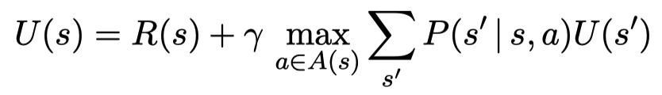
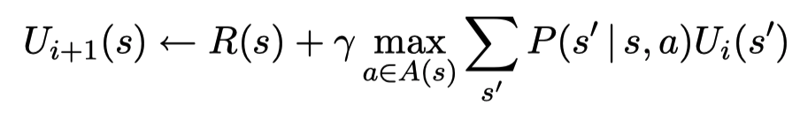
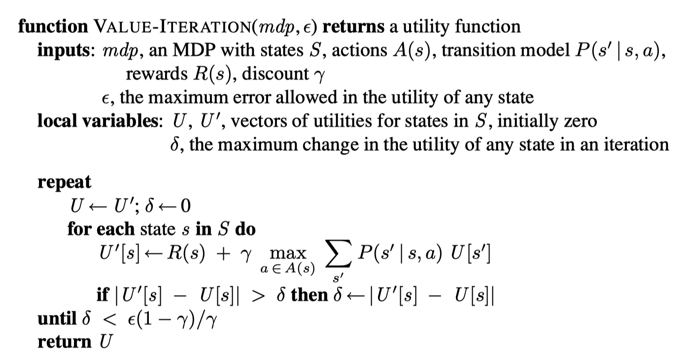

# OpenAI Gym Frozen Lake Reinforcement Learning
Implemented as a [Markov Decision Process (MDP)](https://en.wikipedia.org/wiki/Markov_decision_process)

Compares both Value Iteration and Policy Iteration algorithms
# References
### Bellman Equation

### Bellman Update

### Value Iteration

### Policy Extraction

Code was originally created during CSCI 3482: Artificial Intelligence at [Saint Mary's University](https://smu.ca)
